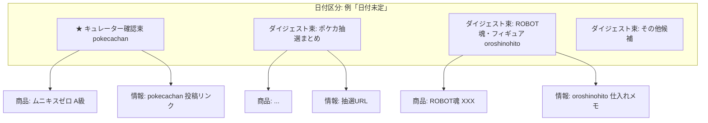

# MarketLens「全候補＋情報ダイジェスト」UI プラン

> **Goal:** 商品タブで**全候補**を見られるようにし、再来週以降・日付未定も**折りたたまず詳細まで読める**形にする。  
> 同一日付区分の中では **@pokecachan / @oroshinohito** のように「商品＋情報」を**束ねて表示**する。  
> **重要:** 彼らは見た目のお手本だけでなく、**扱う商品そのものが信頼できる基準**である。  
> **終着点:** 最終的に MarketLens が**単独で拾う商品の質・精度**が彼らと**同程度**になり、**先回り・網羅・独自厳選で追い越す**こと。

**参照キュレーター（信頼アンカー → 精度ベンチマーク）:**

| アカウント | 信頼する理由 | 担当カテゴリ | 投稿の型 |
|-----------|-------------|-------------|----------|
| **@pokecachan** | ポケカ抽選・予約・再販を継続監視。期日・URL・商品名の精度が高い | ポケカ（主） | `【ポケカ抽選】` → 📅 → 🎯 → 🔗 |
| **@oroshinohito** | 物販・転売視点で仕入れ先・出口・利益余地を実務ベースで整理 | フィギュア / 物販 / 限定品（主） | 🛒 → 📈 → 💡 |

**更新:** 2026-06-23（信頼キュレーション方針追記 / **精度収束を終着点に追加**）

---

## 1. 現状ギャップ

| 項目 | 現状 | ユーザー要望 |
|------|------|-------------|
| 表示件数 | **~28件**（`isDisplayable` 厳格） | **964候補すべて**にアクセス |
| 再来週以降 | 折りたたみ（件数のみ） | **詳細まで展開** |
| 日付未定 | 折りたたみ + **418件**が大半 | **テーマ別に束ねて**読める |
| 情報の混在 | 商品カードのみ | **商品＋抽選/バズ/ルート情報**を同じ束 |
| レイアウト | フラットな2行カード | **日付区分 → ダイジェスト束 → 商品/情報** の3層 |
| **信頼基準** | AI判定のみ | **キュレーター言及＋公式**で束の芯を固定 |

**データ上の内訳（最新 snapshot）:**

- productGroups: **964**
- Gemini判定: **210**（残り754は未判定/HOLD）
- Tier: T1=13, T2=10, T3=5, HOLD=936
- 日付未定: **418** / 再来週以降: **27**
- discoveryCandidates: **966**（UI未接続）
- buzzSignals: **66**（俯瞰のみ）
- **既存:** snapshot 内に `@pokecachan` / `@oroshinohito` の documents・events・buzz samples あり（**未活用**）

---

## 1b. 信頼キュレーション方針（本プランの核心）

> **型を真似るだけでは不十分。** ユーザーが X で彼らをフォローしているのは、**「この人が扱う商品なら見る価値がある」**から。  
> MarketLens も同じ基準で **束の芯・表示順・昇格** を決める。

### 証拠の優先順位（PRODUCT_DIRECTION 拡張）

```
公式・実売  >  信頼キュレーター言及  >  一般バズ  >  ブログ/未確認
     ↑              ↑
  価格正本      商品選定の正本（今回追加）
```

| レベル | 条件 | UI |
|--------|------|-----|
| **A: キュレーター確認** | pokecachan/oroshinohito が **72h以内**に同一商品を言及 | 束の先頭・「確認済みキュレーター」バッジ |
| **B: 公式＋キュレーター** | 上記 + 公式/抽選URL が一致 | **最優先束**・厳選モードでも表示 |
| **C: キュレーターのみ** | 言及あるが自社 productGroup 未整備 | **情報行から商品候補を生成**（昇格待ち） |
| **D: 自社のみ** | 収集したがキュレーター未言及 | 全候補モードで表示・下位 |
| **E: キュレーター言及なし＋公式なし** | バズ/ブログのみ | 薄色・「要確認」 |

### キュレーター別の担当（束のデフォルト担当）

| キュレーター | 束を主導するカテゴリ | 束タイトル前缀 |
|-------------|-------------------|---------------|
| pokecachan | pokeca, onepiece（抽選系） | `【ポケカ抽選】` `【ポケカ新弾】` |
| oroshinohito | figure, limited, kuji（物販系） | `【物販】` `【転売注目】` |

**ルール:** 1商品に両者言及 → **両方の情報行**を束に載せ、商品行は1つ。矛盾時は **公式 > pokecachan（期日）> oroshinohito（利益）**。

### 信頼できる理由（設計上の前提）

- **pokecachan:** 抽選期間・当選発表・応募URL をセットで出す → 日付未定418件の **期日付与** に使える
- **oroshinohito:** 仕入れ先と出口をセット → HOLD 多数の中から **「見る価値あり」** を絞れる
- 両者とも **アカウント名を商品名にしない**（自社パイプラインのゴミ除外と整合）

### やらないこと（信頼の線引き）

- キュレーター言及 = Tier 自動 T1 **にはしない**（AI判定は維持。表示優先度と束形成のみ昇格）
- キュレーター投稿の **アフィリエイト URL を正本にしない**（公式 URL を正とする）
- 競合「先回りスコア」と混同しない（先回りは Layer 6、信頼は **品質フィルタ**）

---

## 1c. 終着点 — キュレーション精度の収束

> **短期:** 彼らの言及で「何を見るか」を教わる。  
> **中期:** 自社の拾い漏れ・拾いすぎを彼らと**差分計測**し、パイプラインを直す。  
> **長期:** キュレーター言及がなくても、**厳選に載る商品の質**が彼らの投稿水準と同等になる。  
> **終着:** **同等を超える** — より早く拾い、より網羅し、彼らが扱わない高価値候補も厳選に載せる。

### 精度の定義（彼らが信頼される理由と同じ軸）

| 軸 | 意味 | 計測例 |
|----|------|--------|
| **選定精度（Precision）** | 厳選に出す商品が「彼らが扱う価値のある商品」か | 厳選 T1/T2/B級のうち、72h以内にキュレーター言及 or 公式イベント一致した割合 |
| **網羅（Recall）** | 彼らが扱った重要商品を取りこぼさないか | キュレーター言及商品のうち、自社 productGroup が **同日〜+1日** に存在した割合 |
| **フィールド精度** | 名前・期日・URL が正しいか | 商品名 fuzzy 一致率、期日±1日、応募URLが公式ドメインと一致 |
| **ノイズ排除** | 彼らが出さないゴミを混ぜないか | アカウント名商品・無関係 SKU・古い再販のみの誤昇格率 |

### 3段階ロードマップ

```
[今] アンカー依存     curatorTrust で表示・束形成。彼らが「正解セット」
      ↓
[次] 差分フィードバック  毎 cycle: curator-diff レポート（拾い漏れ / 拾いすぎ / 期日ズレ）
      ↓
[先] 自律同等精度       厳選 = 彼らが出すであろう商品集合に収束
      ↓
[超] 追い越し           leadRate↑ + exclusivePicks↑（彼らより先・彼ら以外の価値も拾う）
```

### 差分 → パイプライン改善（学習ループ接続）

| 差分 | 改善先 |
|------|--------|
| **拾い漏れ**（彼ら言及・自社なし） | Discovery Agent シード、buzz クエリ、source-config 追加 |
| **拾いすぎ**（自社厳選・彼ら無言） | screening / rejudge プロンプト厳格化、HOLD 基準引き上げ |
| **期日ズレ** | pokecachan 投稿 📅 を events 補完 → 将来は公式スクレイプ正本化 |
| **名前ズレ** | productKey 正規化、members 統合ルール |
| **カテゴリ偏り** | pokecachan=ポケカ / oroshinohito=物販 の担当外は別ベンチマーク追加 |

**新規スクリプト（Phase 7）:** `scripts/curator-quality-diff.mjs`  
→ cycle 末尾で `curatorQualityReport` を snapshot に保存（UI の「精度」タブ or 俯瞰用）

### 成功条件（North Star KPI）

| 指標 | 現状 | 中期（3ヶ月） | 終着（6ヶ月+） |
|------|------|--------------|---------------|
| キュレーター Recall | 未計測 | **≥70%** | **≥90%** |
| 厳選 Precision（彼ら基準） | 低（~28件表示） | **≥60%** | **≥85%** |
| 期日フィールド一致 | 418件未定 | 言及分 **100%** 表示 | 公式一致 **≥95%** |
| ノイズ率（厳選） | 未計測 | **<15%** | **<5%** |
| **自律厳選** | 0% | — | 厳選の **≥80%** がキュレーター言及**なし**でも彼らが扱う水準 |
| **先回り率（leadRate）** | 未計測 | **≥30%** | **≥60%**（彼ら言及より先に自社で拾う） |
| **独自厳選（exclusivePicks）** | 0 | **≥10/cycle** | **≥30/cycle**（彼ら未言及・事後検証で正当） |

「自律厳選」= AI＋公式＋実売だけで T1/T2/B級に載り、事後検証でキュレーターも同商品を扱う（または扱うべきだった）割合。  
「追い越し」= **Recall ≥90% を維持しつつ** leadRate と exclusivePicks を伸ばす（同等の上に、速さと網羅で勝つ）。

---

## 2. 目標 UX（完成像）

### 2.1 画面モード（商品タブ上部）

```
[厳選] [全候補]     ← デフォルトは「全候補」
```

| モード | 内容 |
|--------|------|
| **厳選** | 現行同等（Gemini T1/T2/T3 + 品質フィルタ） |
| **全候補** | 名前正常な全 productGroup + 紐づく情報。**キュレーター確認を上部固定** |

### 2.2 日付区分（縦軸・変更なし）

```
━━ 今日・明日 ━━
━━ 今週 ━━
━━ 来週 ━━
━━ 再来週以降 ━━   ← デフォルト展開（折りたたみ廃止 or オプション）
━━ 日付未定 ━━     ← 同上。418件を束ねて読む
```

### 2.3 同一日付区分内の3層構造（新規・核心）



**レイヤー定義:**

| Layer | 名前 | 中身 |
|-------|------|------|
| **L1** | 日付区分 | today / this_week / next_week / later / undated |
| **L2** | **ダイジェスト束（bundle）** | 同テーマの商品＋情報。**キュレーター言及があれば束の芯** |
| **L2★** | **信頼束（trusted bundle）** | A/B 級。セクション最上部に固定 |
| **L3a** | 商品行 | productGroup 1件（既存カード拡張） |
| **L3b** | 情報行 | 抽選ルート / buzz / 公式リンク / ニュース1件 |

---

## 3. ダイジェスト束の見た目（お手本）

### @pokecachan 型（抽選・予約・新弾）

```
┌─ ★ 確認済みキュレーター: @pokecachan ──────────┐
│ 【ポケカ抽選】ムニキスゼロ                      │
│ 📅 受付  1/9 11:00 〜 1/12 23:59  （投稿より）   │
│ 🎯 発表  1/23 11:00                             │
│ 🔗 応募  イトーヨーカドーネット（公式確認済）    │
│ 📎 出典  pokecachan 6/18 投稿                   │
│ ───────────────────────────────────────────────│
│ ■ 商品  ポケモンカード MEGA 拡張パック ムニ…    │  T2
│ ■ 情報  公式抽選ページ                          │
└─────────────────────────────────────────────────┘
```

### @oroshinohito 型（物販・転売・仕入れ）

```
┌─ 【物販】ROBOT魂 再販チェック ────────────────┐
│ 🛒 入手  プレミアムバンダイ / 定価圏         │
│ 📈 出口  メルカリ参考 ¥12,000（未売却）       │
│ 💡 判断  AI: 再販品のため様子見 (HOLD)        │
│ ─────────────────────────────────────────────│
│ ■ 商品  ROBOT魂 ズワァース                    │
│ ■ 商品  ROBOT魂 同シリーズ（members 2件）     │
└───────────────────────────────────────────────┘
```

**文体ルール（PRODUCT_DIRECTION 準拠）:**

- 丁寧語・完結した文
- 絵文字は **構造マーカーのみ**（📅🎯🔗🛒📈）。装飾乱用しない
- 利益は sold=確定 / listing=参考 / AI=予測 を色分け

---

## 4. 束ねるロジック（L2 クラスタリング）

### Phase 0 — 信頼キュレーター同期（最優先・パイプライン）

**Files:** `data/trusted-curator-accounts.json`（新）, `scripts/trusted-curator-sync.mjs`（新）

```json
{
  "curators": [
    {
      "handle": "pokecachan",
      "role": "pokeca_lottery",
      "trustLevel": "anchor",
      "categories": ["pokeca", "onepiece"],
      "bundlePrefix": ["【ポケカ抽選】", "【ポケカ新弾】"]
    },
    {
      "handle": "oroshinohito",
      "role": "resale_goods",
      "trustLevel": "anchor",
      "categories": ["figure", "limited", "kuji"],
      "bundlePrefix": ["【物販】", "【転売注目】"]
    }
  ]
}
```

**sync 処理（毎 cycle）:**

1. Yahoo リアルタイム `from:pokecachan` / `from:oroshinohito` で直近投稿取得
2. 投稿から **商品名・期日・URL** を抽出（既存 buzz パーサ拡張）
3. `snapshot.curatorMentions[]` に保存:
   ```javascript
   { handle, productName, productKey?, postedAt, dates, urls, postUrl, matchScore }
   ```
4. productGroup と fuzzy マッチ → `group.curatorTrust = { level, handles[], postedAt }`
5. マッチしない言及 → `discoveryCandidates` へ **キュレーター昇格候補** として追加

**Acceptance:** ムニキスゼロ等、彼らが扱っている商品に `curatorTrust.level >= B` が付く。

### Phase A — 決定論クラスタ（UI）

| 優先 | キー | 例 |
|------|------|-----|
| **0** | **キュレーター言及** | pokecachan が言及した商品を束の芯に |
| 1 | **カテゴリ** | pokeca / onepiece / kuji / figure / limited |
| 2 | **イベント種別** | lottery / sale / release / preorder |
| 3 | **共有日付** | 同じ `startsAt` または `endsAt` の日（日単位） |
| 4 | **IPキーワード** | ムニキスゼロ / ROBOT魂 / 一番くじ 作品名 |
| 5 | **ソースドメイン** | pokemon-card.com / p-bandai.jp / 1kuji.com |

**束タイトル生成（テンプレ）:**

```
【{カテゴリラベ}{イベント種別}】{代表商品名 or IP名}
例: 【ポケカ抽選】ムニキスゼロ
例: 【フィギュア予約】ROBOT魂 6月再販
例: 【くじ情報】一番くじ 〇〇 当日情報
```

**束内ソート:**

1. curatorTrust A/B の商品
2. 公式 event あり
3. Gemini T1/T2
4. その他（D/E）

### Phase B — AI 束タイトル（任意・flash）

- 入力: 束内 productGroups + 紐づく routes/buzz
- 出力: `bundleTitle`, `bundleLead`（1〜2文、pokecachan 口調）
- 対象: **日付未定・再来週** のみ（件数多いため）

### 情報行（L3b）のデータソース

| 種類 | snapshot フィールド |
|------|---------------------|
| **キュレーター投稿** | `curatorMentions`, documents（pokecachan/oroshinohito） |
| 抽選/販売ルート | `lotteryRoutes`, `productEvents`, `routeSnapshots` |
| Xバズ | `socialSearchSignals`（buzzEligible） |
| メルカリ参考 | `marketplaceSignals` |
| 候補（未昇格） | `discoveryCandidates`（名前マッチ） |
| 探索タスク | `explorationTasks` |

**紐付け:** `productKey` / 名前正規化 / カテゴリ / 共有 eventId

---

## 5. 全候補表示ポリシー

### 5.1 表示ティア（全候補モード）

| ティア | 表示 | スタイル |
|--------|------|----------|
| T1/T2/T3 + Gemini | 通常 | 既存カード |
| **A/B キュレーター確認** | 最上部 | ★バッジ + 出典リンク |
| HOLD + **キュレーター言及** | 表示 | 「キュレーター確認・AI見送り」 |
| HOLD + Gemini（言及なし） | 下位 | 薄色 |
| 未判定 + **キュレーター言及** | **優先表示** | 「要AI判定・キュレーター確認済」 |
| 未判定（言及なし） | 下位 | 「AI未判定」 |
| 名前異常 | 非表示 | 現行フィルタ維持 |

### 5.2 フィルタ（カテゴリ横タブは維持）

- 全体 / ポケカ / ワンピカ / くじ / フィギュア / 限定品 / その他
- **検索ボックス**追加（全候補モードで必須）

### 5.3 再来週・未定のデフォルト

- **折りたたみ OFF**（全候補モード）
- 束単位のミニ折りたたみのみ（1束=5〜15件）
- 仮想スクロール or 「束を10件ずつ読み込み」（418件対策）

---

## 6. 実装フェーズ

### Phase 0 — 信頼キュレーター同期（2日）★最優先

**Files:** `data/trusted-curator-accounts.json`, `scripts/trusted-curator-sync.mjs`, `scripts/curator-parse.mjs`, `run-marketlens-cycle.mjs`

- [x] pokecachan / oroshinohito を **anchor** として固定（competitor とは別概念）
- [x] 投稿 → 商品名・期日・URL 抽出 → `curatorMentions`
- [x] productGroup へ `curatorTrust` 付与
- [x] 未マッチ言及 → discoveryCandidates 昇格候補
- [x] rejudge プロンプト: 「キュレーター確認済みは HOLD 慎重、期日は投稿を参考に」
- [x] cycle 組み込み（postprocess 直後 + digest 前に quality diff）

**Acceptance:** snapshot 内の pokecachan 言及商品が UI/API で `curatorTrust` 参照可能。

### Phase 1 — 全候補モード + 展開（2〜3日）

**Files:** `script.js`, `index.html`, `styles.css`

- [x] `getVisibleGroups(mode)` — `strict` / `all` 切替（デフォルト全候補）
- [x] 再来週・未定: 全候補モードでデフォルト展開
- [x] HOLD / 未判定行のスタイル + キュレーターバッジ
- [x] 検索フィルタ
- [x] 件数ヘッダ: `全候補 N件表示（名前正常 M件）`
- [x] 厳選: A/B キュレーター確認は AI HOLD でも表示

**Acceptance:** 全候補モードで 400件以上スクロール可能。厳選モードは現状維持。

### Phase 2 — ダイジェスト束 L2（3〜4日）

**Files:** `script.js`（新: `buildDigestBundles`）, `styles.css`

- [x] セクション先頭: **信頼束（★）** を固定表示
- [x] `buildDigestBundles` — Phase 0 の curatorTrust を最優先キーに
- [x] `renderDigestBundle(bundle)` — pokecachan 型ヘッダ
- [x] L3a 商品行 = 既存 `renderProductCard` ラップ
- [x] L3b 情報行 = `renderInfoRow`（キュレーター出典 + 公式URL のみ）
- [x] 束内ソート: 商品 → 情報 → 関連度
- [x] 8件超の束はミニ折りたたみ

**Acceptance:** 日付未定が「418件フラット」ではなく「N束」表示。

### Phase 3 — 情報行のデータ接続（未着手）

**実装前にプランを確定すること。** 以下は草案。

**Files:** `script.js`, 必要なら `scripts/postprocess-marketlens-snapshot.mjs`

- [ ] productKey ↔ lotteryRoutes / routeSnapshots マッチ
- [ ] productKey ↔ buzz samples マッチ
- [ ] 情報行タップ → 公式URL / 検索URL へ
- [ ] 商品詳細展開にも関連情報セクション

**Acceptance:** ポケカ束に抽選URL + バズが1束に並ぶ。

### Phase 4 — oroshinohito 型（物販束）（未着手）

**実装前に Phase 3 完了後、UI 方針を再検討すること。**

- [ ] フィギュア/限定品は **物販テンプレ**（🛒入手 📈出口 💡判断）
- [ ] members 複数を1商品行にサブ表示
- [ ] メルカリ参考価格を情報行に

### Phase 5 — AI 束リード（任意・2日）

**Files:** `scripts/marketlens-bundle-narrator.mjs`（新）

- [ ] 日付未定/再来週の各束に `bundleLead` を cycle 時生成
- [ ] snapshot に `digestBundles` メタ保存
- [ ] UI はメタ優先、なければテンプレ

### Phase 6 — 回帰・性能（1日）

- [ ] `ui-regression-check.mjs` 更新
- [ ] 400+ DOM: 束単位遅延レンダ or Intersection Observer
- [ ] 360px モバイル確認

### Phase 7 — 精度収束・追い越しループ（継続・Phase 0 以降並行）

**Files:** `scripts/curator-quality-diff.mjs`（新）, `run-marketlens-cycle.mjs`, `prediction-accuracy.mjs` 連携

- [x] 毎 cycle: キュレーター言及 vs 自社 productGroup の **Recall / Precision / leadRate** を計算
- [x] `snapshot.curatorQualityReport` 保存（拾い漏れリスト → discovery シード自動投入は次段）
- [ ] 拾いすぎリスト → rejudge / screening プロンプトへ週次反映
- [ ] 俯瞰タブに **精度スコア** 1行（Recall % / leadRate % / surpassScore）
- [ ] 月次: North Star KPI（§1c）レビュー

**Acceptance:** 1 cycle 後に diff レポートが生成され、surpassScore が snapshot に載る。

---

## 7. データモデル（UI内部）

```javascript
// 1日付区分あたり
{
  sectionKey: "undated",
  bundles: [
    {
      id: "bundle:pokeca:lottery:munikiszero",
      title: "【ポケカ抽選】ムニキスゼロ",
      category: "pokeca",
      eventKind: "lottery",
      dateRange: { start, end, announce },
      lead: "...",           // Phase 5
      curatorTrust: { level: "A", handles: ["pokecachan"], postUrl, postedAt },
      products: [ ProductGroup, ... ],
      infos: [
        { kind: "curator", handle: "pokecachan", postUrl, excerpt },
        { kind: "route", label, url, observedAt },
        { kind: "buzz", text, heatScore, sourceUrl },
        { kind: "marketplace", price, note },
      ],
    },
  ],
  unbundled: [ ... ],  // どの束にも入らなかった単独候補
}
```

---

## 8. @pokecachan / @oroshinohito — 信頼・型・**精度ベンチマーク**

| レイヤー | 施策 |
|----------|------|
| **信頼（正本）** | `trusted-curator-sync` で言及商品を抽出・`curatorTrust` 付与 |
| **精度ベンチマーク** | `curator-quality-diff` で Recall/Precision を計測し、**拾う商品の質**を彼らに近づける |
| **束の芯** | 彼らが言及した商品で L2 束を開始（418件未定の整理軸） |
| **期日補完** | pokecachan 投稿の 📅🎯 を `events` 不足群へ補完候補 |
| **厳選モード** | B級以上は **AI HOLD でも表示**（「キュレーター確認」ラベル付き） |
| **型（UI）** | 見出し・絵文字・情報行レイアウトは投稿形式に合わせる |
| **競合監視との差** | competitor=先回りスコア / curator=**品質・信頼・精度の正解セット** |

**テンプレ辞書（UI のみ）:**

```
pokecachan: 【{cat}{kind}】{name} / 📅 / 🎯 / 🔗 / 📎出典
oroshinohito: 【物販】{name} / 🛒 / 📈 / 💡 / 📎出典
```

**データは既に partial に存在:** snapshot の documents・socialSearchSignals（accountHandle: pokecachan）・trendCandidate を **curatorMentions 正本に統合**する。

---

## 9. KPI

### 短期（UI・可視化）

| 指標 | 現状 | 目標 |
|------|------|------|
| 商品タブで見える候補 | ~28 | **800+**（名前正常） |
| 日付未定の平均スクロール深度 | 折りたたみで0 | **3束以上**読了 |
| 1束あたり情報行 | 0 | **≥2**（route+buzz等） |
| 厳選モード T1/T2 | 23 | 維持 |
| **キュレーター確認商品** | 未計測 | **≥30**（両者言及ベース） |
| 日付未定で期日補完 | 418 | **キュレーター言及分に 📅 表示** |
| B級が厳選モードに出る | 0 | **≥15**（HOLD でも表示） |

### 終着（North Star — §1c）

| 指標 | 現状 | 6ヶ月+ 目標 |
|------|------|------------|
| キュレーター Recall | 未計測 | **≥90%** |
| 厳選 Precision（彼ら基準） | 低 | **≥85%** |
| 自律厳選比率 | 0% | **≥80%** |
| 先回り率 leadRate | 未計測 | **≥60%** |
| 独自厳選 exclusivePicks | 0 | **≥30/cycle** |
| surpassScore | 未計測 | **≥0.75** |

---

## 10. 推奨着手順

1. **Phase 0** — 信頼キュレーター同期（**商品の信頼性**の本体）
2. **Phase 1** — 全候補モード + 再来週/未定展開
3. **Phase 2** — 信頼束を先頭にしたダイジェスト UI
4. Phase 3 — 情報行のデータ接続（**プラン確定後**）
5. Phase 4 — 物販型（**Phase 3 後に方針再検討**）
6. Phase 5〜6 — AI 束リード・性能
7. **Phase 7** — 精度収束ループ（**拾う商品の質**を彼ら水準へ — 並行・継続）

**Phase 0 が無いと「型だけ真似」になる。** 先に curatorMentions を snapshot に載せる。  
**Phase 7 が無いと「彼ら依存のまま」で終わる。** diff 計測で自律同等精度へ収束させる。

---

## 11. スコープ外（本プランではやらない）

- X API 直接取得（Yahoo リアルタイム維持）
- 全964件への Gemini 再判定（別プラン: rejudge 拡張）
- 自動投稿 to X（読む専用 UI のみ）
