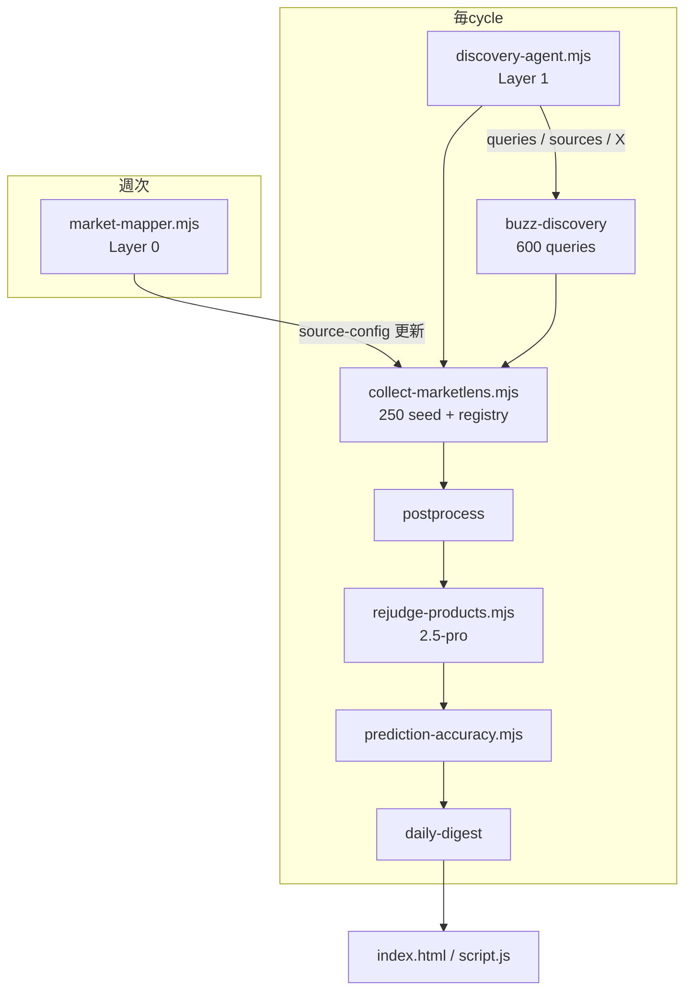

# MarketLens PRODUCT_DIRECTION 完全実装プラン

> **Goal:** `docs/PRODUCT_DIRECTION.md` の未実装 33 項目 + 部分実装 38 項目を、安全境界を維持したまま段階的に ✅ にクローズする。
>
> **正本:** プロダクト方針は `PRODUCT_DIRECTION.md`。本プランは実行計画のみ。
>
> **更新:** 2026-06-23

---

## 1. 現状サマリ

| 区分 | 件数 | 代表ギャップ |
|------|------|-------------|
| ✅ 完了 | 12 | 2タブUI、XSS、productGroup、安全境界 |
| 🟡 部分 | 38 | flash 判定、40/200ソース、buzz 0件、sold 0件 |
| ❌ 未着手 | 33 | Discovery Agent、競合監視、学習ループ、Yahoo!フリマ |
| ⏸ 後回し | 1 | PWA icons |

**ブロッカー（他作業の前提）:**

1. `script.js` — `getSignalPrice` が `c.price` を参照（実データは `c.value`）
2. `run-marketlens-cycle.mjs` — rejudge 未統合（collect が Gemini 判定を上書き）
3. buzz — パーサ・熱量スコアなし（600クエリを投げても拾えない）
4. メルカリ sold — URL/Playwright パス未検証（soldCandidates 常に 0）

---

## 2. 目標 KPI（全 Phase 完了時）

| 指標 | 現状 | 目標 |
|------|------|------|
| buzzQueries | 6 | **600**（生成器 + Agent 追加） |
| seed sources | 40 | **250** |
| X accounts | 30 | **500** |
| registry fetch/cycle | ~90 | **≥200** |
| buzz 成功/cycle | 0 | **≥50** |
| soldCandidates/cycle | 0 | **≥20** |
| T1/T2 メルカリ紐付け | 低 | **≥40%** |
| Gemini 本判定 | flash-lite | **2.5-pro**（T1/T2 優先） |
| CI 実行 | 4/日 | **8/日** full cycle |
| PRODUCT_DIRECTION ❌ | 33 | **0**（⏸ PWA 除く） |

---

## 3. アーキテクチャ（完成形）



**データフロー原則（維持）:**

- raw `browser_observed_candidate` / `jpyCandidate` → `priceSnapshots` 直接昇格禁止
- AI 利益 = 参考値。sold のみ緑表示
- 公式 > 実売 > X > ブログ

---

## 4. Phase 一覧

| Phase | 期間目安 | 目的 | クローズ ID |
|-------|---------|------|------------|
| **0** | 2日 | 即効バグ・cycle 安定化 | FRM-01 UI、OPS-03 一部 |
| **1** | 4日 | 5倍 seed + 生成器 | X-05、SRC-04 一部 |
| **2** | 7日 | 自律探索（L0/L1/L6） | L0,L1,L6,X-04,SPD-05 |
| **3** | 5日 | バズ・X・熱量 | L2c,X-02,X-03,FRM-03 |
| **4** | 5日 | フリマ実体化 | L2d,L2e,FRM-01〜03 |
| **5** | 4日 | AI pro 化 + 学習 | L3,L4,AI-01〜06 |
| **6** | 4日 | UI 完成 + フィルタ | UI-04〜19,DOM |
| **7** | 3日 | CI 速度 | SPD-01〜03,OPS-02〜03 |
| **8** | 継続 | ソース200件埋め | SRC-01〜08 |

**合計:** 約 5〜6 週間（並行可能なタスクあり）

---

## Phase 0 — 基盤修正（Day 1–2）

> 他 Phase の前提。最優先。

### 0-1 メルカリ UI バグ

**Files:** `script.js`

- [ ] `getSignalPrice`: `c.value` + `currency === "JPY"` フィルタ
- [ ] `getMarketSignal`: productKey 正規化 + canonicalName ファジーマッチ
- [ ] カード利益表示: sold=緑 / listing=黄「参考」/ AI=黄「AI予測」

**Acceptance:** T1 商品で listing 121件中、JPY 紐付け ≥10件が UI に黄表示

### 0-2 Cycle 順序 + rejudge 統合

**Files:** `scripts/run-marketlens-cycle.mjs`, `package.json`

- [ ] 順序: collect → postprocess → **rejudge** → buzz → digest
- [ ] buzz は collect **後**（snapshot 上書き防止）
- [ ] `MARKETLENS_SKIP_REJUDGE=1` で CI 短縮可能
- [ ] collect が gemini judgment を消さないよう merge ポリシー確認

**Acceptance:** cycle 1回後 `gemini judged ≥600` が維持される

### 0-3 404 URL 修正

**Files:** `data/source-config.json`（collect 経由で更新する場合は seed 修正スクリプト）

- [ ] pokemon calendar / p-bandai / 1kuji 404 を正 URL に差替
- [ ] `ui-regression-check.mjs` に dead URL 警告追加

### 0-4 回帰

- [ ] `node scripts/ui-regression-check.mjs`
- [ ] `node scripts/regression-check.mjs`

---

## Phase 1 — 5倍 Seed + 生成器（Day 3–6）

### 1-1 バズクエリ 600件

**Files:** `scripts/generate-buzz-queries.mjs`（新規）, `data/buzz-queries.json`（新規）, `scripts/marketlens-buzz-discovery.mjs`

- [ ] IP×キーワード matrix 生成（即完売/プレ値/争奪戦/min_faves 等）
- [ ] ワンピカ **20%** 枠（120件）
- [ ] `MARKETLENS_BUZZ_QUERY_LIMIT=600`、日次バッチ 100×6
- [ ] buzz-discovery が `buzz-queries.json` を読む

**Acceptance:** 設定上 600 クエリ。1 cycle で ≥10 fetch 成功

### 1-2 X アカウント seed → 500

**Files:** `data/x-accounts.json`（新規）, `scripts/import-x-accounts.mjs`（新規）, `data/source-config.json`

- [ ] 手動 seed 100（転売・速報・公式・ワンピカ）
- [ ] trendCandidate へ import
- [ ] buzz サンプルから `@handle` 自動抽出（Phase 2 へ接続）

### 1-3 固定ソース seed 250

**Files:** `data/source-config.json`, `scripts/expand-source-seeds.mjs`（新規）

| カテゴリ | 追加目標 |
|----------|---------|
| 公式/カレンダー | +11 → 30 |
| くじ/抽選 | +14 → 15 |
| ニュース/レビュー | +24 → 30 |
| コミュニティ | +20 |
| 価格比較/在庫 | +20 |
| フリマ入口 | +15（カテゴリURL） |

- [ ] registry `DISCOVERY_SOURCE_LIMIT` → 200
- [ ] `MARKETLENS_ACTIVE_SOURCE_FETCH_LIMIT` → 150

---

## Phase 2 — 自律探索 L0/L1/L6（Day 7–13）

### 2-1 Discovery Agent v1

**Files:** `scripts/discovery-agent.mjs`（新規）, `scripts/marketlens-gemini-contract.mjs`

**入力:** snapshot（T1/T2、explorationTasks、buzz メタ、registry 統計）

**出力 JSON:**
```json
{
  "newBuzzQueries": ["..."],
  "newSources": [{ "url", "lane", "reason" }],
  "newXAccounts": ["handle"],
  "mercariPatrol": [{ "productKey", "query", "urgency" }],
  "competitorGaps": [{ "productKey", "theyMentionedAt", "weFoundAt" }]
}
```

- [ ] Gemini **2.5-pro**（`MARKETLENS_DISCOVERY_MODEL`）
- [ ] cycle 先頭で実行 → source-config / buzz-queries / x-accounts に merge
- [ ] explorationTasks を Agent 入力に統合（L1b 予測型探索）

### 2-2 Market Mapper v1（Layer 0）

**Files:** `scripts/market-mapper.mjs`（新規）, `.github/workflows/market-mapper-weekly.yml`（新規）

- [ ] 週1: 「未監視ジャンル」Web 調査 → 新 source 候補 15件
- [ ] registry + source-config へ trial 追加
- [ ] 手動 approve で active 昇格（安全）

### 2-3 Layer 6 競合監視

**Files:** `scripts/competitor-monitor.mjs`（新規）, `data/competitor-accounts.json`（新規）

- [ ] 転売大手 **20アカウント** 固定監視
- [ ] 彼らの言及商品 vs 自社 T1/T2 発見時刻を比較
- [ ] `competitorBeatScore` を snapshot meta に記録
- [ ] 見逃し → Discovery Agent トリガー（source/X 追加）

**Acceptance:** 20アカウント巡回、先回り率メトリクスが snapshot に存在

---

## Phase 3 — バズ・X・熱量（Day 14–18）

### 3-1 Yahoo リアルタイム パーサ強化

**Files:** `scripts/marketlens-yahoo-realtime-reader.mjs`, `scripts/marketlens-buzz-discovery.mjs`

- [ ] like / reply / repost / quote カウント抽出
- [ ] 熱量スコア: `like + repost×2.5 + reply×1.5 + quote×2`
- [ ] 閾値: 1000いいね相当 OR スコア ≥ X
- [ ] `min_faves:1000` クエリの成否検証・代替クエリ

### 3-2 buzz → 商品昇格パイプライン

**Files:** `scripts/marketlens-observation.mjs`, `scripts/postprocess-marketlens-snapshot.mjs`

- [ ] 高熱量 tweet → `discoveryCandidates` → normalizedProducts 候補
- [ ] 転売アカウント以外の一般層バズを優先フラグ
- [ ] overview / UI-04 用 `buzzDiscovery` サマリ

### 3-3 X 500 アカウント自動成長

- [ ] buzz 高熱量投稿者の @handle 自動追加（重複排除、上限 500）
- [ ] 低品質アカウント自動 deprioritize

**Acceptance:** buzz 成功 ≥50/cycle、一般層バズ ≥5/cycle

---

## Phase 4 — フリマ実体化（Day 19–23）

### 4-1 メルカリ sold 取得

**Files:** `scripts/marketlens-mercari-reader.mjs`, `scripts/marketlens-observation.mjs`

- [ ] sold 検索 URL テンプレート（`status=sold_out` 等）検証
- [ ] Playwright fallback 本番パス
- [ ] T1/T2 優先 marketplace キュー（AI 予測巡回 SPD-05）

**Acceptance:** soldCandidates ≥20/cycle

### 4-2 急上昇検出（7日比較）

**Files:** `scripts/marketlens-price-trend.mjs`（新規）, `data/marketlens.history.json`

- [ ] カテゴリ別 7日 median vs 今日
- [ ] 上昇率 ≥20% → `priceTrendAlerts`
- [ ] UI-04 俯瞰「メルカリ急騰」接続

### 4-3 Yahoo!フリマ reader

**Files:** `scripts/marketlens-yahoo-furima-reader.mjs`（新規）

- [ ] 売却済み一覧パース（Jina + Playwright fallback）
- [ ] marketplaceSignals へ sold 統合
- [ ] 安全: browser_observed → priceSnapshots 直接昇格禁止維持

### 4-4 ヤフオク / ラクマ（観測入口）

**Files:** `scripts/marketlens-yahoo-auction-reader.mjs`, `scripts/marketlens-rakuma-reader.mjs`（新規、最小）

- [ ] カテゴリ seed URL から出品中参考価格（listing のみ）
- [ ] SRC-03 フリマ/オークション 20件のうち 10件をカバー

---

## Phase 5 — AI Pro 化 + 学習ループ（Day 24–27）

### 5-1 Flash-Lite 専用スクリーニング（L3）

**Files:** `scripts/marketlens-screening.mjs`（新規）, `scripts/collect-marketlens.mjs`

- [ ] 全 normalizedProducts に Yes/No: 商品名か / 転売対象か
- [ ] No → HOLD + collect 本判定スキップ（コスト削減）

### 5-2 本判定 2.5-pro

**Files:** `scripts/rejudge-products.mjs`, `scripts/collect-marketlens.mjs`

- [ ] デフォルト `gemini-2.5-pro`
- [ ] 5 RPM 分散: バッチ間 sleep、T1/T2 優先キュー
- [ ] 出力スキーマ拡張:
  - [ ] `similar_products[]`
  - [ ] `urgency`: immediate / this_week / next_week / watch
  - [ ] `risk_factors[]`

### 5-3 深掘り（T1/T2）

**Files:** `scripts/marketlens-deep-dive.mjs`（新規）

- [ ] `historicalComparables` + pro 追加分析
- [ ] UI-13 詳細「類似商品売却実績」接続

### 5-4 学習ループ（AI-06）

**Files:** `scripts/prediction-accuracy.mjs`（新規）, `scripts/postprocess-marketlens-snapshot.mjs`

1. [ ] 予測保存（rejudge 時点）
2. [ ] 発売後 sold 取得
3. [ ] MAPE / 方向正答率を `productLearning` + カテゴリ別集計
4. [ ] 次回 rejudge プロンプトにカテゴリ傾向を注入

### 5-5 ブリーフィング（L5）

**Files:** `scripts/collect-marketlens.mjs`, `script.js`

- [ ] server-side overview を正とし UI は snapshot `overviewNarrative` を表示
- [ ] client-side `buildClientOverview` は fallback のみ
- [ ] Xバズ・急騰・来週予告を自然文に含める

---

## Phase 6 — UI 完成（Day 28–31）

### 6-1 カテゴリ・セクション

**Files:** `index.html`, `script.js`, `styles.css`

- [ ] **ワンピカ** タブ追加（UI-06）
- [ ] **過去1週間** セクション（UI-08）— 予測 vs 実績
- [ ] 来週 **上位5件 + 「他N件」**（UI-09）
- [ ] 再来週/未定: プレビュー3件 + 展開（UI-10）

### 6-2 表示フィルタ（方針書準拠）

**Files:** `script.js`

- [ ] T3 表示を有効化（UI-15）— tier バッジで区別
- [ ] 利益 ¥1,000 未満除外（UI-16）
- [ ] 仕入 ¥50,000 超除外（UI-17）
- [ ] 締切1週超過除外（UI-18）

### 6-3 スコア式整合

- [ ] `computeScore` を方針書 §3 の式に完全一致
- [ ] 利益確度: sold=40, listing=20, AI=10

### 6-4 詳細・俯瞰

- [ ] 類似商品売却実績ブロック（UI-13）
- [ ] 俯瞰: Xバズ・メルカリ急騰（UI-04）
- [ ] spring アニメ（UI-19）— CSS `@keyframes` + transform

### 6-5 回帰

- [ ] `scripts/ui-regression-check.mjs` 更新（T3、ワンピカ、フィルタ）
- [ ] browser / Playwright 360px 確認

---

## Phase 7 — CI・速度（Day 32–34）

### 7-1 GitHub Actions full cycle

**Files:** `.github/workflows/deploy-pages.yml`, `.github/workflows/marketlens-cycle.yml`（新規）

- [ ] cron **8回/日**（3時間おき）
- [ ] `npm run marketlens:cycle`（rejudge 含む）
- [ ] timeout: collect 90min、rejudge 60min（段階的）
- [ ] secrets: `GEMINI_API_KEY`

### 7-2 イベント駆動頻度

**Files:** `scripts/source-priority.mjs`（新規）

- [ ] 発売7日前: 関連 source の `fetchPriority=high`
- [ ] 重要ソース 1h / 通常 6h 相当の **論理優先度**（Actions 内で sort）

### 7-3 差分検出強化

- [ ] 商品レベル content hash → 変更のみ LLM 再処理
- [ ] registry promote/demote ログ

---

## Phase 8 — ソース200件クローズ（継続）

Phase 1 seed + Phase 2 Agent + registry promote で段階達成。

| カテゴリ | Phase 1 後 | Phase 8 目標 |
|----------|-------------|-------------|
| 公式 30 | 30 | ✅ |
| くじ 15 | 15 | ✅ |
| フリマ 20 | 10 | 20 |
| X 50 | 30 | 50 |
| ニュース 30 | 30 | ✅ |
| コミュニティ 20 | 20 | ✅ |
| 価格比較 20 | 20 | ✅ |
| AI追加 15+ | Agent | 15+/week |

**Acceptance:** `source-config` seed ≥250、active+ trial fetch ≥200/cycle

---

## 5. 依存関係

```
Phase 0 ──► Phase 1 ──► Phase 2 ──► Phase 3
                │                      │
                └──────────► Phase 4 ◄──┘
                                │
              Phase 0 ──► Phase 5 ◄── Phase 4
                                │
                            Phase 6
                                │
                            Phase 7
                                │
                            Phase 8（並行）
```

- Phase 5 の学習ループは Phase 4 sold データに依存
- Phase 6 UI-04 は Phase 3 buzz + Phase 4 急上昇に依存
- Phase 2 Discovery Agent は Phase 1 seed がないと品質低い → 0 の次が 1

---

## 6. 新規ファイル一覧

| ファイル | Phase |
|----------|-------|
| `scripts/generate-buzz-queries.mjs` | 1 |
| `data/buzz-queries.json` | 1 |
| `data/x-accounts.json` | 1 |
| `scripts/import-x-accounts.mjs` | 1 |
| `scripts/expand-source-seeds.mjs` | 1 |
| `scripts/discovery-agent.mjs` | 2 |
| `scripts/market-mapper.mjs` | 2 |
| `scripts/competitor-monitor.mjs` | 2 |
| `data/competitor-accounts.json` | 2 |
| `scripts/marketlens-price-trend.mjs` | 4 |
| `scripts/marketlens-yahoo-furima-reader.mjs` | 4 |
| `scripts/marketlens-yahoo-auction-reader.mjs` | 4 |
| `scripts/marketlens-rakuma-reader.mjs` | 4 |
| `scripts/marketlens-screening.mjs` | 5 |
| `scripts/marketlens-deep-dive.mjs` | 5 |
| `scripts/prediction-accuracy.mjs` | 5 |
| `scripts/source-priority.mjs` | 7 |
| `.github/workflows/marketlens-cycle.yml` | 7 |
| `.github/workflows/market-mapper-weekly.yml` | 2 |

---

## 7. 検証コマンド

```bash
# 各 Phase 後
node --check script.js
node scripts/ui-regression-check.mjs
node scripts/regression-check.mjs
node scripts/product-group-contract-regression.mjs

# Phase 1+
node scripts/generate-buzz-queries.mjs --dry-run

# Phase 0+
npm run marketlens:cycle
npm run marketlens:rejudge

# ローカル UI
npx http-server -p 18765 -c-1 --cors
# → http://127.0.0.1:18765/index.html
```

---

## 8. リスクと緩和

| リスク | 緩和 |
|--------|------|
| Gemini 5 RPM / 503 | バッチ分散、retry、T1/T2 優先、flash-lite screening で件数削減 |
| Yahoo パース失敗 | Jina フォールバック、クエリ A/B、Bright Data scrape |
| メルカリブロック | Playwright 間隔、T1/T2 のみ、観測データは参考扱い |
| collect が rejudge 上書き | Phase 0-2 merge ポリシー + cycle 順序 |
| 200ソースで Actions timeout | 8回/日に分割、差分のみ LLM、degraded 許容 |
| コスト超過 | pro は T1/T2 + 新規のみ。T3/HOLD は flash |

---

## 9. 推奨着手順（最初の1週間）

| 日 | タスク | クローズ |
|----|--------|---------|
| D1 | Phase 0-1 UI バグ | FRM-01 一部 |
| D1 | Phase 0-2 cycle+rejudge | #3, OPS-03 |
| D2 | Phase 0-3 URL + 回帰 | — |
| D3–4 | Phase 1-1 buzz 600 生成器 | X-02 準備 |
| D4–5 | Phase 1-2 X seed 100 | X-05 |
| D5–6 | Phase 1-3 source 250 seed | SRC 一部 |
| D7 | Phase 2-1 Discovery Agent v1 | L1, #5 |

---

## 10. 完了定義（Definition of Done）

`PRODUCT_DIRECTION.md` 実装ステータス表の全 ID が ✅ または ⏸（PWA のみ）になった時点で本プラン完了。

追加確認:

- [ ] T1/T2 商品 ≥80件が UI 表示
- [ ] sold 実績 ≥20件が緑表示
- [ ] buzz ≥50件/cycle
- [ ] 競合先回りスコアが snapshot に記録
- [ ] 学習ループ MAPE がカテゴリ別に出力
- [ ] CI 8回/日 green
- [ ] 安全境界回帰すべて pass
